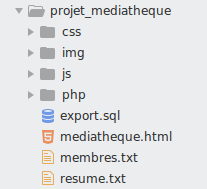

#  Prog web client riche - JavaScript 

### IUT Montpellier-Sète – Département Informatique

## TD6
#### _Thème : AJAX, mise en place d'une application médiathèque_

Cliquez sur le lien ci-dessous pour faire, dans un dossier public_html/JS/TD6, votre fork privé du TD6 (**attention, pas de fork à la main !**):

https://classroom.github.com/a/ow1HkVsz

la version [pdf](ressources/td6.pdf)

## INTRODUCTION

Pour ce travail vous allez devoir programmer le fonctionnement d’une mini-médiathèque. Vous aurez à gérer des adhérents, des livres et les emprunts. 

L’idée essentielle est d’avoir une interaction souple avec la base de données par le biais de la technologie AJAX.

Vous disposez pour ce TD, qui pourrait tenir lieu de projet, d’une liberté totale pour l’environnement web (pour le html et le css). 

Pour vous donner une idée de départ, l’interface pourrait ressembler à cette capture d’écran :

	

	capture d’écran 1 – affichage classique

## Fonctionnalités de base
	
Cette application travaillera en lien avec une base de données que vous devrez vous-même structurer. Vous devrez tenir compte des entités `adherent` et `livre`, et de la relation `emprunt` entre un `adherent` et un `livre`.

On supposera que l’accès à cette application est sécurisé, vous n’avez pas à vous poser de problème de connexion, comme cela a pu arriver en prog web serveur au S3. 

Vous pouvez développer toutes les fonctionnalités que vous jugez intéressantes. Vous pouvez de même complexifier la base de données au besoin. 

L’utilisateur pourra au minimum :

+ enregistrer un nouvel adhérent ;
+ enregistrer un nouveau livre ;
+ disposer à tout moment, sous les yeux, des trois listes donnant les adhérents, les livres disponibles à l’emprunt, et les livres empruntés. La liste des adhérents permet de voir combien un adhérent emprunte de livres en ce moment ;
+ avoir accès, par un clic sur le nom de l’adhérent, à la liste des livres qu’il a en sa possession en ce moment ;
+ avoir accès, par un clic sur le titre du livre disponible à l’emprunt, à une fenêtre qui permet de prêter le livre à un adhérent ;
+ avoir accès, par un clic sur le titre du livre prêté, à une fenêtre proposant la restitution du livre.
	
	
Il est bien entendu que l’utilisateur récupère, à chaque nouvelle utilisation, l’état précédent de la médiathèque.

Chaque action modifiant la base de données occasionnera une mise à jour de l’interface. Ci-dessous des captures d’écran possibles en fonction des actions.

	

	capture d’écran 2 – clic sur un adhérent

	

	capture d’écran 3 – clic sur un livre disponible

	

	capture d’écran 4 – clic sur un livre emprunté

## Conseils et Consignes

Structurez précisément votre architecture de fichiers. Exemple : 

	

Structurez vos tables de données comme vous savez le faire. Il serait bon d’en donner une trace (fichier `export.sql`) dans le fichier .zip que vous rendrez.

Produisez un code JavaScript propre avec des classes contenant les méthodes adéquates.

Même si ce n’est pas le thème principal, vous aurez à écrire un peu de PHP. Inspirez vous du TD5 au besoin (`Model.php`, `Conf.php` et `cityRequest.php`).

Cette architecture de fichiers comportera, en plus des fichiers informatiques, un fichier texte membres.txt donnant les membres du groupe, et un autre fichier texte resume.txt, descriptif concis de votre travail et notice claire d’utilisation.

La date de remise du travail sera précisée en cours. A respecter.

	

